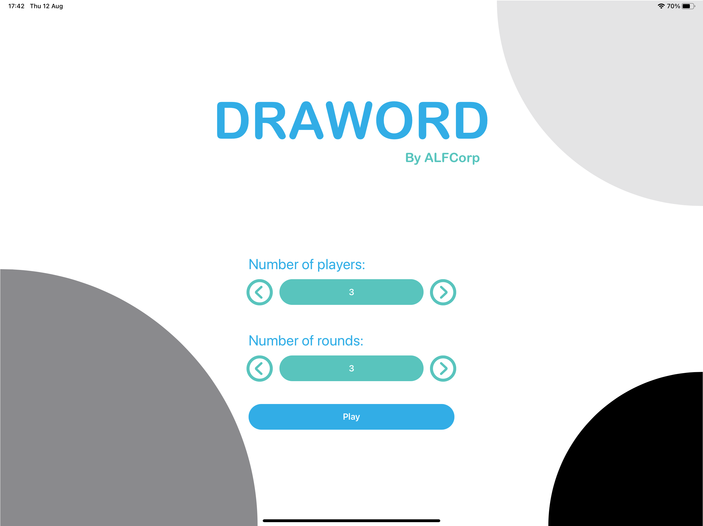
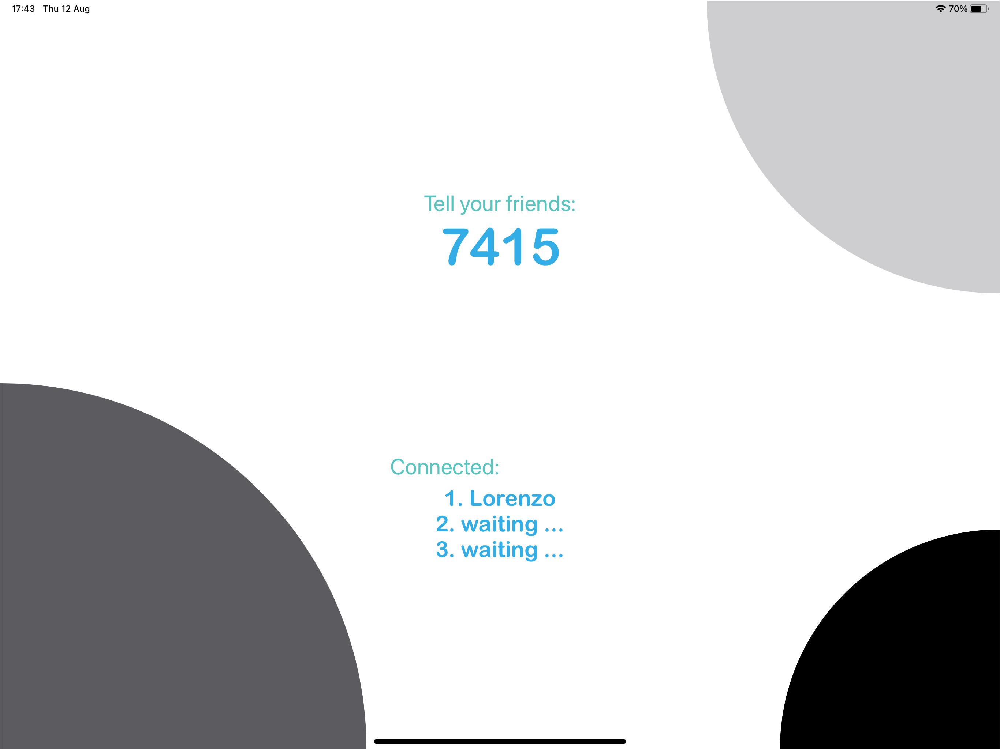
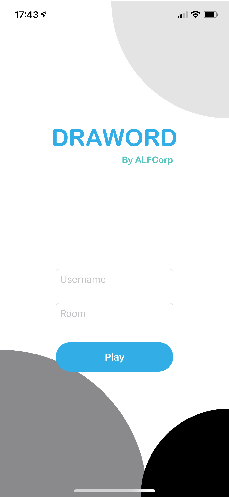
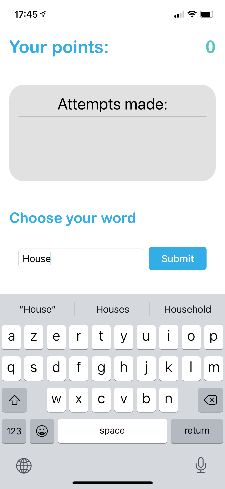
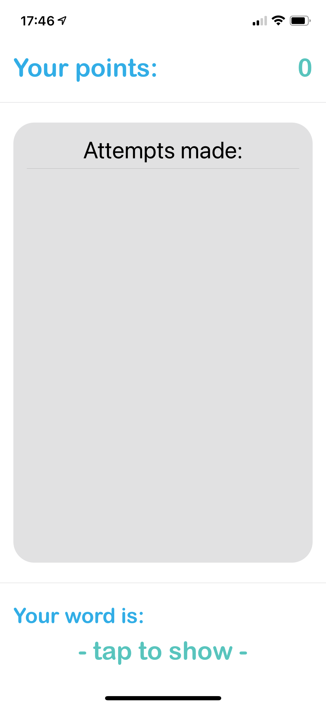
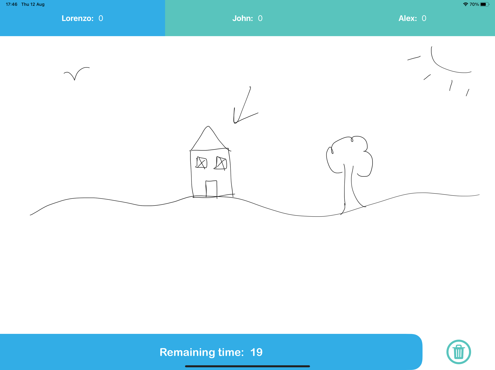
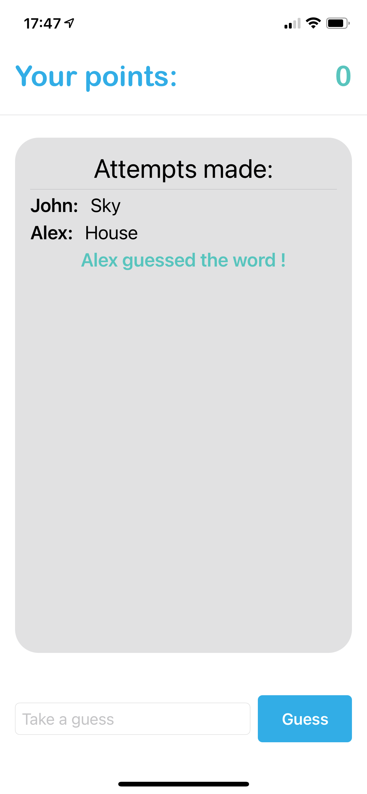
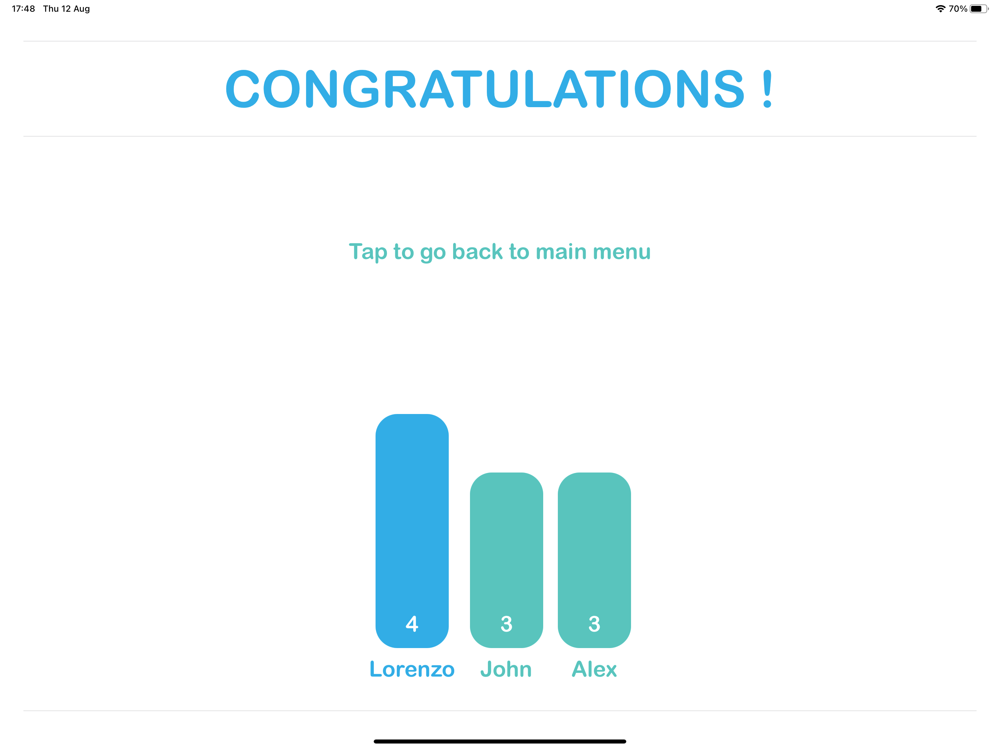
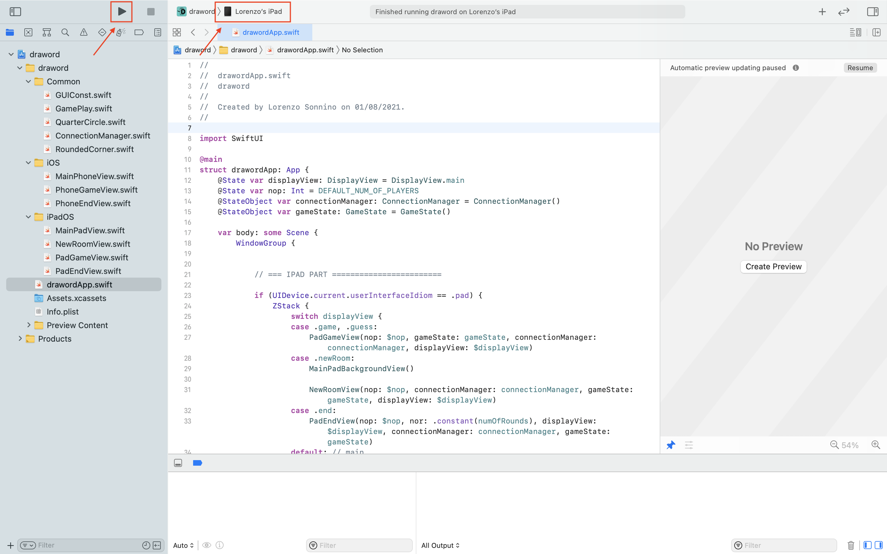

# Draword
Draword is a local pictionary-like game for iPhone and iPad. One player at a time choses a word for the other players to guess. Then draws the word he chose to help the other players. The first player who guesses the word gets a point as well as the drawer.

## Concept

To play this game, you will need one iPhone per player and one iPad for the group. The iPad will serve as the main device while the iPhone serves as a personal consol for each player.

### Rules

The game is divided into *rounds*, each beeing divided into *turns*. The number of rounds in a game is selected at the beginning of the game while the number of turns per round is equal to the number of players. Each turn, one player is the *drawer* while the others are the *guessers*. The drawer changes every turn so that every player gets to be the drawer once each round.

The turn starts with the drawer selecting a word. The drawer has then a fixed amount of time to draw something to help the guessers guess the word. The drawer cannot:

* Talk
* Show the word he chose to other players
* Draw words
* Use a secret code to communicate with another player

The guessers make attempts until either a guesser guesses the word or the timer ends. If a player guessed the word, the word is reveiled to the other players and both the guesser who guessed the word first and the drawer gets one point. If the timer ended without any guesser guessing the word, no player gets the point. Either way, the timer is reset, a new drawer is selected and a new turn starts. The attempts guessers make are visible to the other guessers as well as the drawer.

After each round has been played, the player(s) with the highest number of points wins the game.

### Create a game

On the iPad, select the number of players and the number of rounds. The latter is the number of times each player will have to be the drawer.

The iPad then displays a code identifying the game. Each player can then choose a username and join the game using the code.

The game then starts.

### Playing the game

Each turn, the drawer chooses his word on his phone. The word is then hidden on his phone but he can still reveals it in case he forgets by tapping the "Tap to reveal" text. The word is then hidden once again once he taps it again. The drawer can then draw on the iPad. The iPad displays the current score of each player, the timer as well as a "delete" button to quickly erase the drawing.

The guessers can make attempts and watch other's attempts on their phones.

At the end of the game, the iPad shows the final scores.

## How to install

1. Open the project with x-code (which is in the `draword` folder)
2. Connect your iPad/iPhone with a cable to your Mac
3. Select your device
4. Click play

## Todo

If you are feeling up to the challenge, here is a todo-list:

* Better use of multipeer connectivity: do not implement client-server
* Reestablish closed connection when the app gets back from background or when a problem occurs

